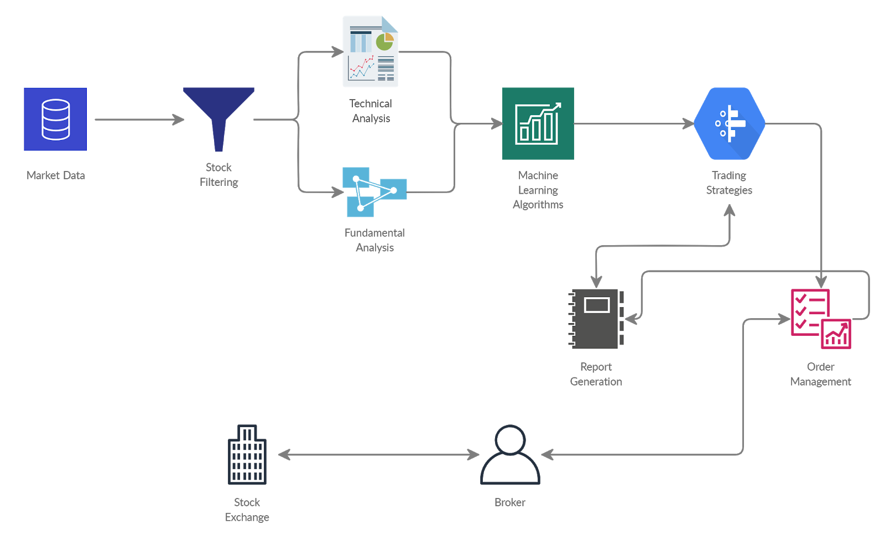
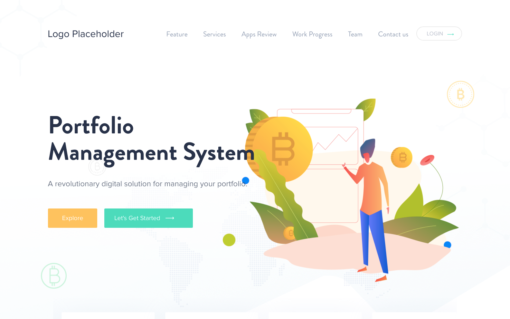
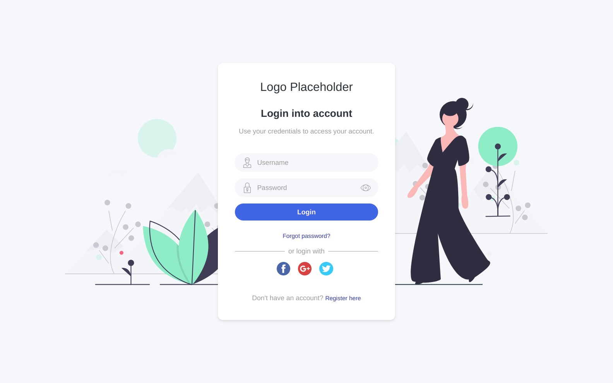
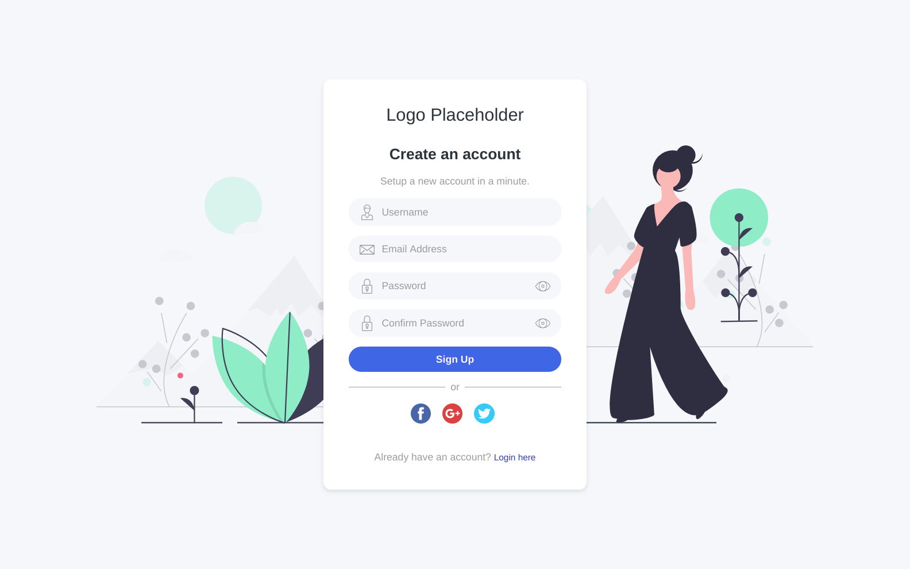
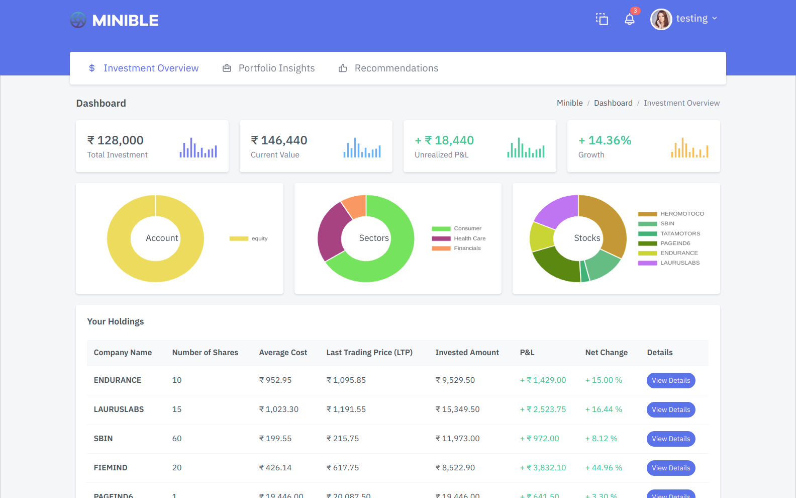
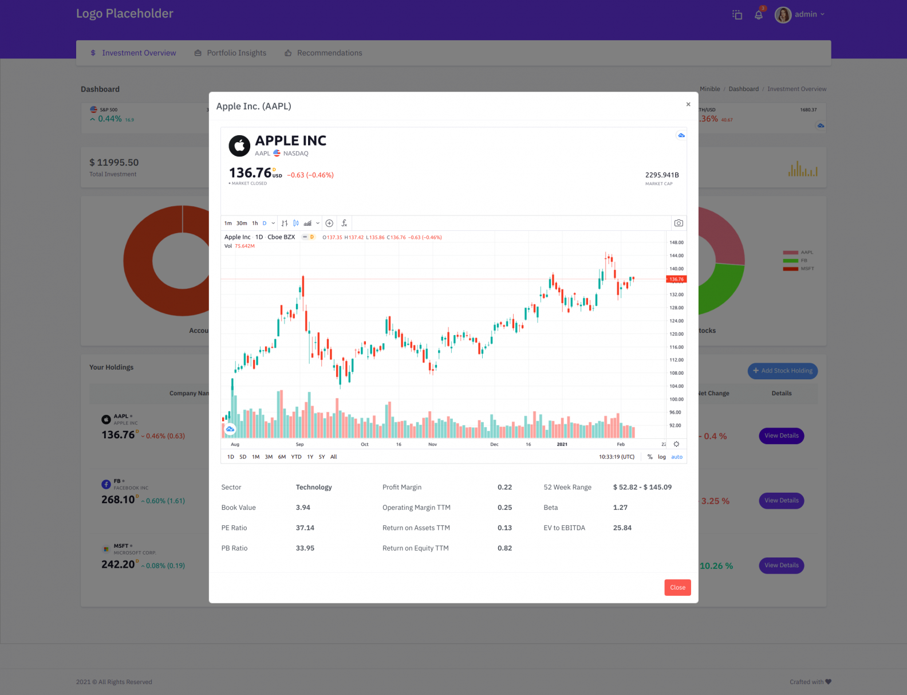
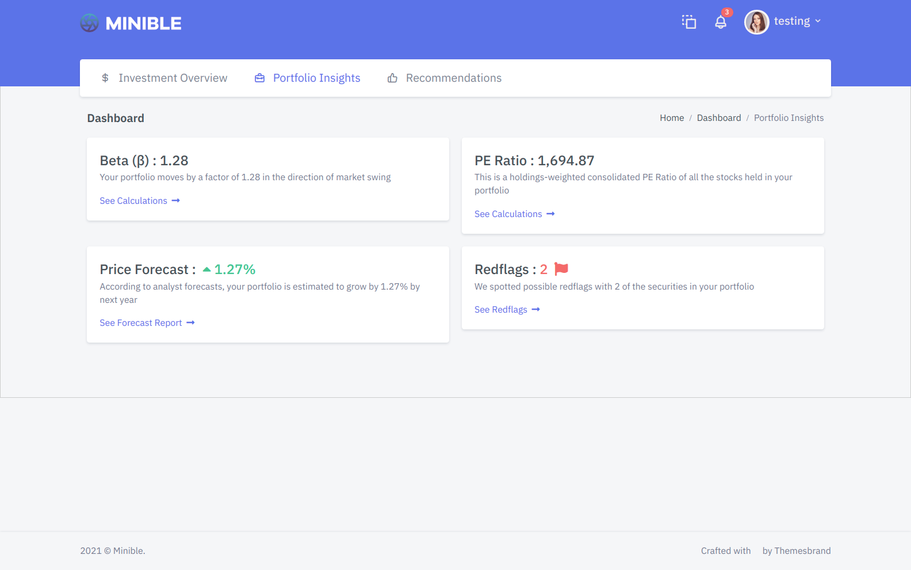
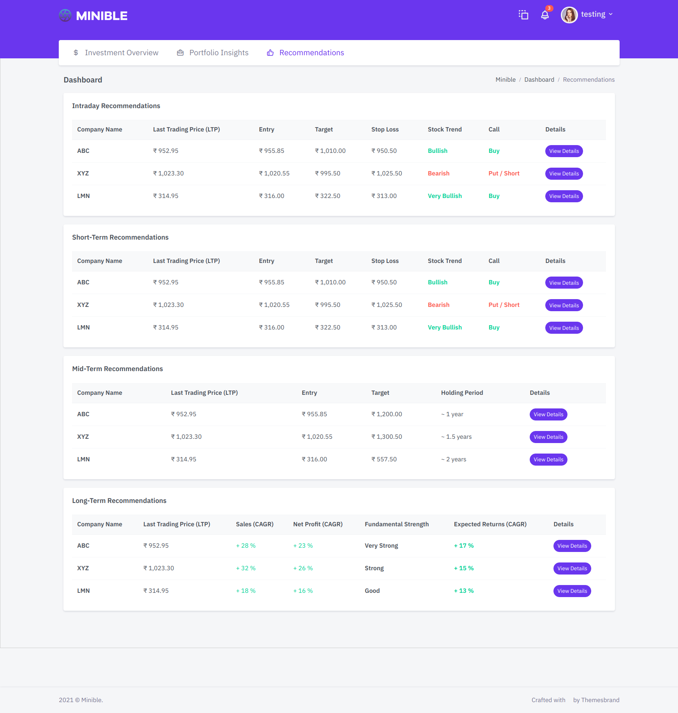

# Portfolio-Management-System

## Motivation
- In these unprecedented times many people have lost their wealth because of wrong investment decisions made, which are encouraged by human emotions.
- A strong system built on back-tested data would drive away human emotions and help people to make the right investment decision purely based on algorithms and statistics.
- Less than 1.5% of people in India invest in the stock markets and the majority lack knowledge in terms of the right stocks to invest and how to manage their portfolios efficiently. 
- Our aim is to build a strong portfolio management system which would encourage more people to invest in the markets and make the right investment decisions.

## Idea
Design and create a portfolio management system which aims to :
- Maximize the alpha (returns) and minimize the risk.
- Implement various trading & investing strategies using technical & fundamental analysis.
- Optimize strategies using machine learning algorithms.
- Use Algorithmic Trading to remove the psychological & emotional bias faced during the investment process.

## Architecture Diagram

## Few Web Pages Screenshots

## Using Project Locally
1. Clone the repository `git clone https://github.com/bpagare6/Portfolio-Management-System.git`
2. Create virtual environment inside the `Portfolio-Management-System` folder.
3. Activate the virtual environment.
4. Download the requirements, `pip install requirements.txt`
5. Go inside the `portfolio_management_system` folder which is actual Django project.
6. Create a .env file from which your environment variables will be fetched.
7. Make database up to date, `python manage.py makemigrations` and `python manage.py migrate`
8. Run the project `python manage.py runserver`
9. Visit `localhost:8000` in your browser and you should be able to use the project :smiley:.

## Project Progress
- [x] Home Page (Content, Images are yet to be updated)
- [x] Login & Register Page (Logo, Footer are yet to be updated)
- [x] Dashboard UI (Logo, Footer are yet to be updated)
- [x] Dashboard (Investment Overview) - Backend Integration
  - [x] Some Utility Functions (Adding Stocks to Holdings, View Details on dashboard)
  - [ ] Solve issues regarding Alphavantage API request limit (using try-except)
  - [ ] Solve issues regarding TradingView glitches
- [ ] Dashboard (Portfolio Insights, Recommendations) - Backend Integration
- [ ] Risk Profile Page and Backend
- [ ] Database Models (Under Progress)
  - [x] Portfolio Model
  - [x] StockHoldings Model

## Team Members
1. Bhushan Pagare  
2. Purvesh Jain  
3. Manav Peshwani  
4. Nipun Khivansara  

### Would Like to Contribute?
Please watch the video : https://youtu.be/MnUd31TvBoU

Send the pull request, we will review it and if possible will merge it in the codebase :smiley:.